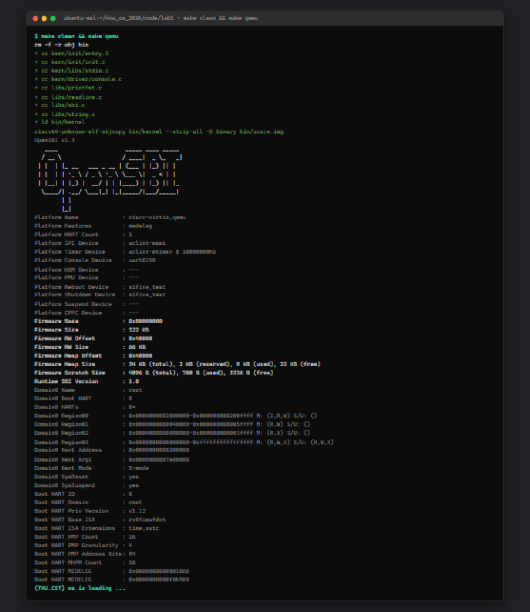
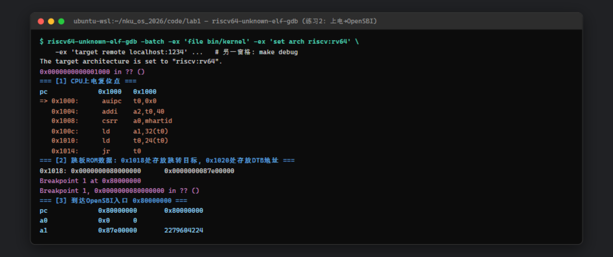
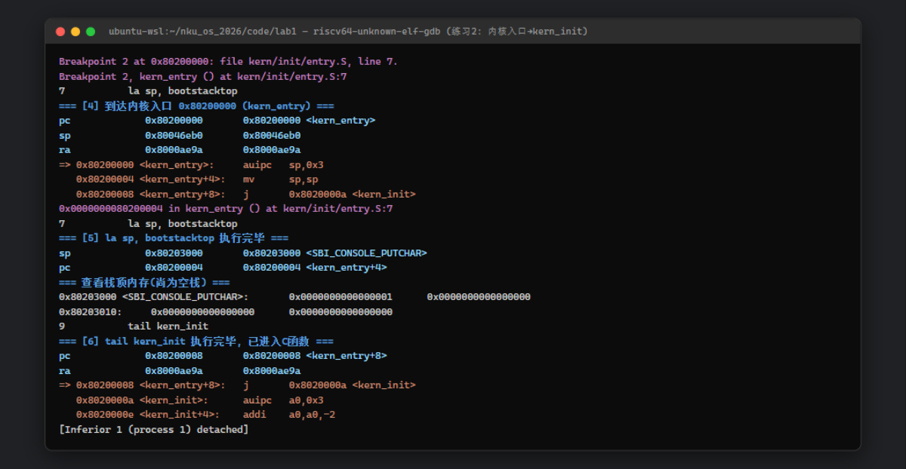

# 操作系统实验报告

## 实验基本信息

| 项目 | 内容 |
|------|------|
| **实验名称** | Lab 1: 最小可执行内核 |
| **小组成员** | 2413421-黄浩天、2413456-林涛、2413460-彭亚滨 |
| **完成日期** | 2026-09-29 |

### 小组分工

练习如何分工？

练习1 由林涛负责,练习2 由黄浩天负责,彭亚滨负责测试复现与截图核对,具体如下:

| 成员 | 负责的练习/模块 |
|------|----------------|
| 2413421-黄浩天 | 环境搭建与验证(WSL2 + 交叉工具链 + QEMU);<br />QEMU 8.2/OpenSBI 1.3 启动问题定位与 Makefile 修复;<br />练习2:GDB 双终端跟踪 `0x1000 → 0x80000000 → 0x80200000` 全过程并截图;<br />报告整合与仓库提交 |
| 2413456-林涛 | 练习1:`entry.S` 引导栈与尾调用分析;<br />启动流程与内存布局专题:链接脚本 `kernel.ld`(`ENTRY`/`BASE_ADDRESS`/`SECTIONS`)、地址相关性、ELF→BIN;<br />实验目的与整体逻辑主线整理;<br />启动/链接类知识点对照条目 |
| 2413460-彭亚滨 | SBI 输出链路专题:`ecall` 调用约定与 `sbi_call` 内联汇编、`sbi_console_putchar → cons_putc → cputs → printfmt → cprintf` 封装层次;<br />测试复现:独立复跑 `make qemu` 与 GDB 跟踪、核对截图与原始日志;"未对应知识点"与 AI 协作经验部分整理 |

---

## 一、实验目的

本实验的主要目的是：

1. 理解**链接脚本**如何描述内核内存布局,掌握入口点(`ENTRY`)、加载地址(`0x80200000`)等概念;
2. 掌握**交叉编译**流程:在 x86 主机上生成 RISC-V 架构可执行文件(ELF),再用 `objcopy` 转成内核镜像(bin);
3. 理解 QEMU 模拟 RISC-V 计算机的**启动流程**:上电 → Boot ROM → OpenSBI 固件 → 内核,并使用 OpenSBI 作为 bootloader 加载内核镜像;
4. 使用 OpenSBI 提供的 SBI 服务(`ecall`),从"输出一个字符"的原语出发,层层封装出格式化输出函数 `cprintf`,为后续实验的调试输出打基础;
5. 熟悉 **GDB + QEMU 远程调试**方法,能跟踪从加电到内核第一条指令的全过程。

---

## 二、实验环境

你们使用的 AI 工具

| 成员 | AI 编程工具 | 底层模型 | 备注 |
|------|------------|---------|------|
| 2413421-黄浩天 | ZCode(终端 Agent) | GLM 5.3 flash | 全组统一开发环境:WSL2 (Ubuntu 24.04.4)、`riscv64-unknown-elf-gcc` 15.1.0、`qemu-system-riscv64` 8.2.2(内置 OpenSBI v1.3)、GNU Make 4.3 |
| 2413456-林涛 | 【待填】 | 【待填】 |  |
| 2413460-彭亚滨 | 【待填】 | 【待填】 |  |

**说明：**
- **AI 编程工具**：指具体使用的终端工具、编辑器插件、桌面应用或浏览器界面
- **底层模型**：指该工具使用的大语言模型及版本

---

## 三、实验整体逻辑分析

### 2.1 本章节的逻辑主线

本章围绕一个核心问题展开：**操作系统作为一个普通程序,是谁把它加载进内存并让它跑起来的?** 答案是 bootloader。由此本章构建了一条完整的"接力"链条:

```
加电复位 → PC=0x1000 (QEMU 内置 Boot ROM/MROM)
        → 跳转 0x80000000 (OpenSBI 固件,M 模式)
        → OpenSBI 初始化硬件、加载内核到 0x80200000,跳转过去
        → kern/init/entry.S (S 模式,建内核栈)
        → kern_init() (C 语言,清 .bss、cprintf 输出、死循环)
```

围绕这条主线,lab1 把一个几千行的"胖麻雀"(ucore)片成只剩骨架的**最小可执行内核**,并解决两个关键问题:

1. **内核如何被放到正确的位置、控制权如何正确移交** —— 内存布局、链接脚本、ELF→BIN;
2. **在"一无所有"的环境里如何打印调试信息** —— 从 OpenSBI 的 SBI 服务原语层层封装出 `cprintf`。

### 2.2 功能的逐步实现

1. **首先用链接脚本(`tools/kernel.ld`)固定内核的内存布局** → 因为内核是地址相关代码(编译时绝对地址已写进指令),必须保证第一条指令恰好落在 OpenSBI 约定跳转的 `0x80200000` 处。链接脚本的核心指令:

   ```ld
   OUTPUT_ARCH(riscv)        /* 输出目标架构: riscv */
   ENTRY(kern_entry)         /* 入口符号: kern_entry */
   BASE_ADDRESS = 0x80200000;
   SECTIONS {
       . = BASE_ADDRESS;     /* "." 定位计数器,内核从这里开始摆放 */
       .text : { *(.text.kern_entry) *(.text .stub .text.* ...) } /* kern_entry 放最前 */
       .rodata : { ... }     /* 只读数据 */
       . = ALIGN(0x1000);    /* 页对齐 */
       .data : { ... } .sdata : { ... }
       PROVIDE(edata = .);   /* 供 kern_init 清 .bss 用 */
       .bss : { ... }        /* 只记大小不占镜像文件的零初始化段 */
       PROVIDE(end = .);
       /DISCARD/ : { *(.eh_frame .note.GNU-stack) }
   }
   ```

   `ENTRY(kern_entry)` + `*(.text.kern_entry)` 排在最前,共同保证**内核第一条指令就是 `kern_entry`** 且位于 `0x80200000`——这是与 OpenSBI 对接的硬约定;`edata/end` 符号被 `kern_init()` 用于清零 `.bss`(bin 镜像里不含 .bss 内容,需要内核自己清)。
2. **接着写 `entry.S` 建立内核栈并进入 C** → 因为 C 函数(调用、局部变量、被调用者保存寄存器)完全依赖栈,而此时 `sp` 还指着 OpenSBI 的栈,不能沿用:`la sp, bootstacktop` 让 `sp` 指向 `.data` 段预留的 8KB 引导栈顶,`tail kern_init` 不留返回地址地跳入 C 入口(详细分析见练习1)。
3. **然后封装最底层的输出原语 `sbi_call`(`libs/sbi.c`)** → 内核运行在 S 模式,能直接借力的只有 OpenSBI(M 模式)提供的服务;跨特权级必须用 `ecall`,按"SBI 调用约定"把功能号放 `a7`、参数放 `a0-a2`,借助 C 内联汇编完成寄存器装填,实现 `sbi_console_putchar`:

   ```c
   __asm__ volatile (
       "mv x17, %[sbi_type]\n"  "mv x10, %[arg0]\n"
       "mv x11, %[arg1]\n"      "mv x12, %[arg2]\n"
       "ecall\n"                "mv %[ret_val], x10"
       : [ret_val] "=r" (ret_val)
       : [sbi_type] "r" (sbi_type), [arg0] "r" (arg0),
         [arg1] "r" (arg1), [arg2] "r" (arg2)
       : "memory");
   ```
4. **再向上层层封装出 `cprintf`** → `console.c: cons_putc()` 只做简单转发;`kern/libs/stdio.c` 的 `cputch/cputs` 实现字符串+计数;`libs/printfmt.c` 实现 `%d/%x/%s/%c` 等格式化解析;最终得到与标准库 `printf` 功能基本相同的 `cprintf`——不依赖 glibc,因为它本质依赖的是另一个操作系统,而我们在造操作系统。每层只加一点能力(字符→带计数的串→格式化),像搭积木一样从固件原语长出调试输出的全部能力。
5. **用 Makefile 把上述环节串成一条命令** → 编译全部源文件、链接成 ELF、`objcopy` 剥离成 bin 镜像、启动 `make qemu` 让 OpenSBI 加载运行;`make debug`/`make gdb` 提供双终端远程调试。ELF 含文件头/段表/调试信息、需要加载器解析,适合"有 OS"的场景;bin 是把各段按内存布局拉平的线性映像,OpenSBI 只认它。全局零初始化大数组在 ELF 里只记大小、在 bin 里要实打实铺零,这是两者体积差异的来源。
6. **最后用 GDB 实测验证整条启动链** → 从 `0x1000` 到 `0x80200000` 单步/断点跟踪(见练习2),亲眼确认"固件→引导程序→操作系统"的三级跳。

---

## 四、实验内容与实现

### 练习：练习1 理解内核启动中的程序入口操作

**负责人：** 2413456-林涛

**背景:** QEMU 上电后先运行 M 模式固件 OpenSBI,它完成基本硬件初始化后把控制权跳转到内核加载地址 `0x80200000`(kernel.ld 的 `BASE_ADDRESS`),进入 S 模式。由于 `ENTRY(kern_entry)` 且 `.text.kern_entry` 被放在 `.text` 最前,内核执行的第一条指令就是 `kern_entry`。此时 **`sp` 仍指向 OpenSBI 自己的栈,内核不能沿用**——C 函数的调用、局部变量、callee-saved 寄存器保存全依赖栈,所以建立自己的栈是内核开机后的第一件事。

**`la sp, bootstacktop`:建立内核引导栈。** `la`(load address)是伪指令,把符号 `bootstacktop` 的地址装入 `sp`(实际展开为 `auipc + addi` 的 PC 相对寻址,与内核被加载到哪无关)。`bootstacktop` 是 `.data` 段中 `bootstack: .space KSTACKSIZE`(2 页 = 8KB、4KB 对齐)预留空间的高地址端。因为栈**向下增长**,`sp` 必须指向这块空间的最高地址,压栈才会落进预留区。**目的:** 为进入 C 代码建立第一个可用的运行时栈;否则函数序言的压栈会写坏固件内存或触发访问异常,内核无法进入 C 世界。

**`tail kern_init`:不保存返回地址地跳入 C 内核入口。** `tail` 是伪指令,等价于目标寄存器为 `x0` 的 `jal`——返回地址被直接丢弃,相当于 `goto kern_init`。它与 `call kern_init`(会写 `ra`)的本质区别是刻意的:

1. `kern_init` 声明为 `__attribute__((noreturn))`,清 BSS、打印后死循环,永不返回,保存返回地址毫无意义;
2. 不占用 `ra`、不制造"会返回"的假象,准确表达了**控制权从汇编一次性移交 C,`kern_entry` 使命结束**的语义——这是汇编层面的尾调用。

GDB 实测印证:执行 `tail` 后 `pc` 到达 `kern_init`,而 `ra` 仍保持 OpenSBI 遗留值 `0x8000ae9a` 不变,证明返回地址确实未保存(见练习2 截图)。

---

### 练习：练习2 使用 GDB 验证启动流程

**负责人：** 2413421-黄浩天

**调试方法:** 双终端远程调试——一个终端 `make debug`(QEMU 以 `-S -s` 启动:CPU 暂停、监听 1234 端口),另一个终端 `riscv64-unknown-elf-gdb` 加载符号后 `target remote localhost:1234` 连接。我们用 `-batch` 方式完整复现了跟踪过程:

```bash
riscv64-unknown-elf-gdb -batch \
  -ex 'file bin/kernel' -ex 'set arch riscv:rv64' \
  -ex 'target remote localhost:1234' \
  -ex 'info registers pc'  -ex 'x/6i 0x1000'  -ex 'x/2gx 0x1018' \
  -ex 'break *0x80000000'  -ex 'continue'     -ex 'info registers pc a0 a1' \
  -ex 'break *0x80200000'  -ex 'continue'     -ex 'info registers pc sp ra' \
  -ex 'si' -ex 'info registers sp pc' -ex 'si' -ex 'info registers pc ra' \
  -ex 'detach'
```

**调试前的问题与修复:** 按课程原始 Makefile(`-device loader,file=$(UCOREIMG),addr=0x80200000`)构建时,OpenSBI 打完横幅后内核毫无输出,断点 `b *0x80200000` 永不命中,OpenSBI 日志显示 `Domain0 Next Address : 0x0000000000000000`。原因是指导书配套的 OpenSBI v0.4(fw_jump 语义)固定跳 `0x80200000`,而本机 QEMU 8.2 内置的 OpenSBI v1.3(fw_dynamic)的跳转地址必须由 `-kernel` 参数传入,`-device loader` 只搬运数据、不设置跳转地址,固件实际跳到了 0 地址。据此把 Makefile 的 qemu/debug 目标改为 `-kernel $(UCOREIMG)`,修复后 OpenSBI 报告 `Domain0 Next Address : 0x0000000080200000`,以下跟踪得以进行。

**调试过程与观察结果:**

1. **连接成功时 GDB 报告程序停在 `0x1000`** ——这正是 QEMU 模拟的 RISC-V 处理器的复位地址(reset vector),加电后 PC 被硬件强制置为该值,此处是 QEMU 内置 Boot ROM(MROM)代码,尚未到内核。
2. **反汇编 0x1000 处,最初执行的几条指令为:**

   ```asm
   0x1000: auipc  t0,0x0        # t0 = PC = 0x1000(基址)
   0x1004: addi   a2,t0,40      # a2 = 0x1028(附加参数,未用/预留)
   0x1008: csrr   a0,mhartid    # a0 = Hart ID(读 M 态 CSR,= 0)
   0x100c: ld     a1,32(t0)     # a1 = [0x1020] = 0x87e00000(DTB 设备树地址)
   0x1010: ld     t0,24(t0)     # t0 = [0x1018] = 0x80000000(跳转目标)
   0x1014: jr     t0            # 跳到 0x80000000 → OpenSBI
   ```

   ROM 中的数据表:`[0x1018] = 0x80000000`(OpenSBI 入口)、`[0x1020] = 0x87e00000`(设备树 blob 地址)。
3. **断点 `b *0x80000000` 命中**,进入 OpenSBI 入口,此时寄存器按约定携带参数:`a0 = 0`(boot hart id)、`a1 = 0x87e00000`(DTB 指针)。此后 OpenSBI 在 M 模式完成自身的完整初始化,并把内核镜像放到 `0x80200000`。
   (关于指导书提示的 `watch *0x80200000`:在本环境的 QEMU 8.2 中该观察点**不会命中**——内核镜像是在虚拟 CPU 启动前由 QEMU 的 ROM 装载器直接写入内存的,不经过任何 CPU store 指令;硬件观察点只能捕获 CPU 的写操作。因此我们改用 `b *0x80200000` 验证"控制权移交瞬间"。)
4. **断点 `b *0x80200000` 命中,停在 `kern_entry`(entry.S:7)**,此时:
   - `pc = 0x80200000 <kern_entry>` —— 内核第一条指令确实在该地址执行,链接脚本与 OpenSBI 的约定完全吻合;
   - `sp = 0x80046eb0`、`ra = 0x8000ae9a` —— 均为 OpenSBI 的遗留值,印证了练习1"内核必须自建栈"的分析;
   - 反汇编可见 `la sp, bootstacktop` 展开为 `auipc sp,0x3; addi sp,sp,0`(即 `mv sp,sp`),`tail kern_init` 展开为 `j 0x8020000a <kern_init>`。
5. **单步 `si` 执行 `la sp, bootstacktop` 后:`sp` 由 `0x80046eb0` 变为 `0x80203000`** ——正是 `bootstacktop`(8KB 引导栈顶,GDB 符号显示该地址同时是 `.data` 中 `SBI_CONSOLE_PUTCHAR` 变量的位置,压栈向低地址方向进入 bootstack 区,互不冲突);`x/4gx $sp` 确认空栈内容为全零。
6. **再单步执行 `tail kern_init`:`pc` 到达 `0x8020000a <kern_init>`,而 `ra` 保持 `0x8000ae9a` 不变** ——证实 `tail` 未保存返回地址,内核从此进入 C 函数,随后 `kern_init` 清 BSS 并调用 `cprintf` 输出启动信息。

**问题答案:** RISC-V 硬件加电后最初执行的指令位于复位地址 **0x1000**(QEMU virt 机器的 Boot ROM)。它们的功能是:读取当前 Hart ID 放入 `a0`、从 ROM 数据区取出设备树地址放入 `a1`、取出固件入口地址 `0x80000000` 放入 `t0` 并跳转过去——即把处理器状态按 RISC-V 启动约定装填好,把控制权交给 OpenSBI;随后 OpenSBI 初始化 M 模式运行环境、加载内核到 `0x80200000` 并跳转,完成"Boot ROM → 固件 → 内核"的接力。这与现代 x86 笔记本"UEFI 固件 → 引导程序(GRUB/Boot Manager)→ OS 内核"的三级跳本质相同。

---

## 五、测试与验证

<!-- 根据该实验的具体情况，提供完整的测试运行截图，应包含：
- 编译及运行成功的输出（make qemu），可能有多个
- 测试通过的结果（make grade），只有一个
-->

**测试截图：**

1. 编译及运行成功的输出(`make clean && make qemu`):完整输出编译(`+ cc` 各文件、`+ ld bin/kernel`)、`objcopy` 生成 `bin/ucore.img`、OpenSBI v1.3 横幅(`Domain0 Next Address : 0x0000000080200000`)、最后输出内核信息 `(THU.CST) os is loading ...` 并进入死循环:



2. GDB 启动流程跟踪(练习2)——上电复位点 → OpenSBI 入口:



3. GDB 启动流程跟踪(练习2)——内核入口 `kern_entry` → `kern_init`:



补充说明:

- ELF 布局验证:`riscv64-unknown-elf-readelf/nm` 确认 `Entry point address = 0x80200000`,`kern_entry = 0x80200000`、`bootstack = 0x80201000`、`bootstacktop = 0x80203000`、`edata = end = 0x80203008`,与链接脚本设计一致;
- 完整原始记录存于 `report/image/gdb_trace_raw.log` 与 `report/image/make_qemu_raw.log`;
- 关于 `make grade`:lab1 骨架中未提供 `tools/grade.sh`(该脚本在后续实验代码中才出现),故本实验以 `make qemu` 运行输出与 GDB 跟踪结果作为测试依据。

---

## 六、实验总结与收获

### 对操作系统的理解

1. 列出你们认为本实验中重要的知识点,以及与对应的 OS 原理中的知识点,并简要说明二者的含义、关系和差异

| 本实验知识点 | 对应 OS 原理知识点 | 含义、关系与差异 |
|------|------|------|
| OpenSBI 作为 bootloader | 固件/引导程序(BIOS/UEFI、GRUB) | 原理课上 x86 的 BIOS→MBR→GRUB 链对应这里的 Boot ROM→OpenSBI→内核;差异在于 RISC-V 把固件定为标准化的 SBI,运行在更高特权级 M 态,且后续 OS 可继续调用它的服务 |
| 特权级 U/S/M | 用户态/核心态(双模式) | 原理课通常只讲用户态/核心态两层;RISC-V 硬件提供四层,固件也占一层。`ecall` 从 S 陷入 M 与系统调用从 U 陷入 S 是同一机制在不同边界的复用 |
| `ecall` 调用 SBI 服务 | 系统调用 | 调用约定(功能号+参数+返回值放约定寄存器)完全同构;本实验只有输出字符一项雏形,完整系统调用(陷入分发、上下文保存)在 lab5 才展开 |
| 链接脚本控制内存布局 | 程序装入与链接(逻辑地址→物理地址) | 原理课讲"地址空间"概念;本实验展示其静态形态——编译期就把绝对地址写死,故必须装到约定位置。与之相对的动态重定位/地址无关代码留待虚存章节 |
| ELF 与 BIN 镜像 | 可执行文件格式、程序装入 | ELF 面向"有加载器解析"的场景(保留头部/重定位/符号);bin 是拉平后的内存映像。原理上对应"装载程序把逻辑段映射进内存",bin 相当于跳过解析直接铺内存 |
| 内核栈(bootstack) | 核心态栈、进程内核栈 | 每个线程有自己的内核栈;本实验是全系统唯一的引导栈(8KB、页对齐、在 .data 段预留),后续 lab4 会演化为每进程内核栈 |
| 交叉编译 | 编译与目标机体系结构 | 在 x86 上生成 RISC-V 代码,体现了"编译器后端与目标架构绑定";OS 开发必须交叉编译因为目标机就是正在开发的机器本身 |
| GDB+QEMU 远程调试 | (原理课外延)系统级调试 | QEMU gdbstub 把虚拟 CPU 暴露成调试目标,可观察无 OS 时代的裸机执行流,是内核开发的必备手段 |

2. 列出你们认为 OS 原理中很重要、但在本实验中没有对应上的知识点

- **中断与异常的完整处理**:本实验只用了 `ecall` 这一"主动陷入",尚未实现 trap 向量、`stvec`、上下文保存/恢复;
- **虚拟内存与分页**:内核直接跑在物理地址上,无页表、无地址翻译;
- **同步互斥**:单 hart 顺序执行,无竞争条件、锁、信号量;
- **I/O 与设备管理**:输出靠固件代劳,无设备驱动、无中断驱动 I/O、无缓冲;

### AI 协作开发的经验

1. **给 AI 环境信息比给任务本身更重要**:指导书基于 QEMU 4.1,而实际环境是 QEMU 8.2,原 Makefile 的 `-device loader` 方案在新版 OpenSBI(fw_dynamic)下失效。AI 在拿到"报了什么现象 + QEMU/OpenSBI 版本"后,通过 GDB 观察 `Domain0 Next Address = 0` 快速定位到根因——**版本差异是实验里最容易踩的坑**。
2. **让 AI 给出的结论必须落回实测**:本次所有关键结论(内核能启动、sp 从 0x80046eb0 变为 0x80203000、ra 不变)都用 `make qemu` 和 GDB 单步实际验证过,而不是采信分析。"分析→实测→修正"的闭环在 AI 协作里不能省。
3. **给 AI 的任务要"目标+边界"齐全**:除了"做什么",还要写清"不做什么"——例如要求 AI"仅修改 Makefile 的 qemu/debug 目标,不改动内核源码,不执行 git push",AI 的动作范围就有了明确边界,避免越权操作仓库。
4. **AI 擅长把"骨架代码"讲透**:entry.S、sbi_call 内联汇编这类"为什么必须这么写"的问题,AI 能结合启动流程把因果链讲清,适合用来消化实验框架已给好、但需要理解的代码。

---
